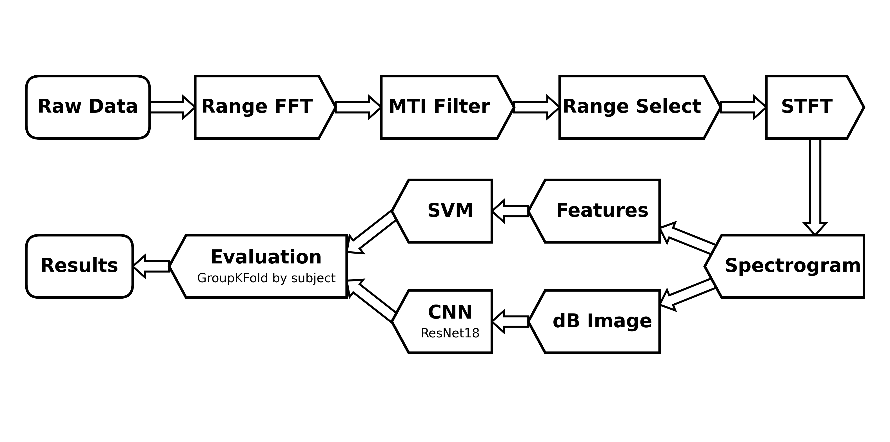

# Human activity classification with FMCW radar

Six-class human activity classification (walking, sitting down, standing up, picking up an object, drinking, falling) from FMCW radar micro-Doppler signatures, on the University of Glasgow "Radar signatures of human activities" dataset (DOI [10.5525/gla.researchdata.848](https://doi.org/10.5525/gla.researchdata.848)). An interpretable physical-feature + SVM model is compared like-for-like against a fine-tuned ResNet18 CNN under subject-independent evaluation, and both are tested on how well they transfer from young lab subjects to elderly residents of care homes. Project for EE4775 Object Classification with Radar, TU Delft.

Group members: Akram Chakrouni, Adam El Haddouchi, Ilyaas Shousha.

## Pipeline



Each raw `.dat` recording is parsed into a complex fast-time x slow-time matrix (128 ADC samples per sweep, column-major reshape). A range FFT along fast time keeps the upper 64 range bins. MTI clutter removal applies a 4th-order Butterworth high-pass (normalized cutoff 0.0075) along slow time per range bin. Range bins 10-30 (MATLAB numbering) are selected and an STFT over slow time (Hamming window of 200 sweeps, 95% overlap, 800-point FFT) is summed across them into one micro-Doppler spectrogram. The spectrogram is cropped to |v| <= 6 m/s and resampled to a 128x128 image. From there two branches: 26 physical micro-Doppler descriptors (centroid, bandwidth and envelope statistics, torso/limb and Doppler-sign energy fractions) feed an RBF SVM, and the 40 dB-normalized image feeds a transfer-learned ResNet18. All evaluation uses 5-fold GroupKFold grouped on the `(dataset, subject)` key, so no subject appears in both train and test.

## Repository layout

```
notebooks/
  01_dataset_index.ipynb       filename parsing, class/site distribution, the label and
                               subject-ID traps, the (dataset, subject) split key
  02_preprocessing.ipynb       the DSP chain step by step, spectrogram caching for all
                               1754 files, the range-window energy check
  03_baseline_classical.ipynb  26 features + SVM/RandomForest, subject-independent CV,
                               confusion matrix, importances -> models/svm_ds1.joblib
  04_cnn_comparison.ipynb      fine-tuned ResNet18 on the dB images, same splits
                               -> models/cnn_ds1.pt
  05_generalization.ipynb      train on lab/university sites, test on elderly care
                               -> models/svm_lab.joblib
  radar_pipeline.py            the shared implementation imported by every notebook:
                               .dat parsing, DSP chain, caching, features, CNN, splits
  README.md                    per-notebook detail and setup notes
models/                        the three trained models listed above
figures/                       figures exported from the notebooks, used in the 1-pager
data/                          not in the repo; download from the Glasgow DOI and place
                               the seven campaign folders under data/Dataset_848/
```

The code resolves the data directory as `data/Dataset_848/` relative to the repository root (`DATA_ROOT` in `radar_pipeline.py`).

## Setup and reproduction

```
python3.13 -m venv .venv && source .venv/bin/activate
pip install -r requirements.txt
python -m ipykernel install --user --name radar --display-name "Python (radar)"
```

Run the five notebooks in order with the `Python (radar)` kernel. Notebook 02 builds the spectrogram cache in `cache/` on first run (all 1754 files, a few minutes, parallel across cores) and is idempotent; the later notebooks load it in seconds. Classical results are deterministic. The CNN uses fixed seeds, but the Apple-silicon GPU backend (MPS) is not bit-reproducible, so notebook 05 averages the CNN over three seeds.

## Results

| Setting | Features + SVM | ResNet18 CNN |
|---|---|---|
| Dataset 1, 6-class, 5-fold subject-independent CV | 0.961 +- 0.014 | 0.964 +- 0.036 |
| Within-source 5-class CV (lab/university sites) | 0.891 +- 0.022 | - |
| Lab -> elderly care transfer (5-class) | 0.767 | 0.761 +- 0.045 |

Dataset-1 CNN uncertainty is over CV folds at seed 0; the transfer CNN is averaged over 3 seeds. RandomForest on dataset 1 reaches 0.939 +- 0.038. Per care site the SVM transfer accuracy is 0.789 (NG Homes) and 0.744 (West Cumbria).

On clean single-site data the interpretable feature model matches the CNN, and the CNN's extra capacity does not survive the domain shift either: accuracy drops roughly 12 points from the within-source ceiling when moving to unseen elderly-care sites. One measured cause is radar geometry: the fixed range window captures only 0.39-0.54 of the signal energy at the care sites against 0.68-0.75 at the lab sites (notebook 02).

## Data and references

- Dataset: University of Glasgow, "Radar signatures of human activities", DOI [10.5525/gla.researchdata.848](https://doi.org/10.5525/gla.researchdata.848). Not redistributed here; see the layout note above for placement.
- Benchmark: Z. Li et al., IET Radar, Sonar and Navigation 18(2), 2024, DOI [10.1049/rsn2.12474](https://doi.org/10.1049/rsn2.12474).
- The accompanying one-page report is submitted separately alongside this repository.